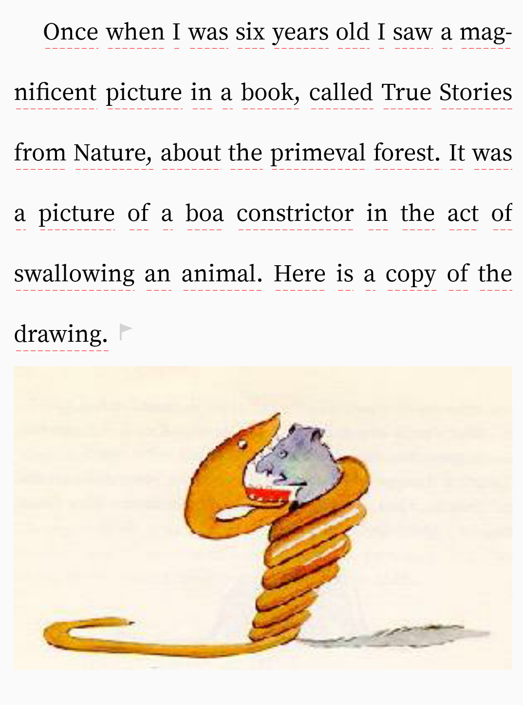

# Texas

Texas是一款支持图文混排的文本渲染库，目前支持两边对齐，并且单词支持断字，用户可以自由的自定义效果。



# 支持的特性

1. 字体颜色
2. 字体
3. 字体大小
4. 行间距
5. 首行缩进
6. 选中字体背景色
7. 选中字体颜色
8. 片段间间距
9. 断字策略
10. 渲染模式，是否是单页，还是多页
11. 是否可选中
12. 自定义解析
13. 资源复用，内存/cpu高度优化

# sample

1. 在layout中引用自定义view

```xml
  <me.chan.te.renderer.TeView
            android:id="@+id/text"
            app:me_chan_te_render_mode="paging"
            android:layout_width="match_parent"
            android:layout_height="match_parent"
            android:layout_margin="10dp" />
```

2. 渲染文本

```java
teView.setSource(new AssetsTextSource(content, "sample.txt"));
```

# 工作流

source负责读取需要渲染的内容，内容被递交给parser， parser解析成渲染引擎能够识别的数据结构


# 资源引用

[english-words](https://github.com/dwyl/english-words.git)

[the book and the sword](https://www.520txtba.com/Txt/XiaoShuo-146678.html)

[async profiler](https://github.com/jvm-profiling-tools/async-profiler)

[JHyphenator](https://github.com/mfietz/JHyphenator)


////

```
text color
url text color
clicked text color
clicked bg color
selected text color -> 选中句子 span text color
selected bg color -> 选中句子背景 span text bg color

image description text color [保留]
href text color [保留]

dash new color 
dash learned color

flag active color [保留]
flag negative color [保留]

typeface normal 
typeface bold

href text size [保留]

间隔单词高亮

```