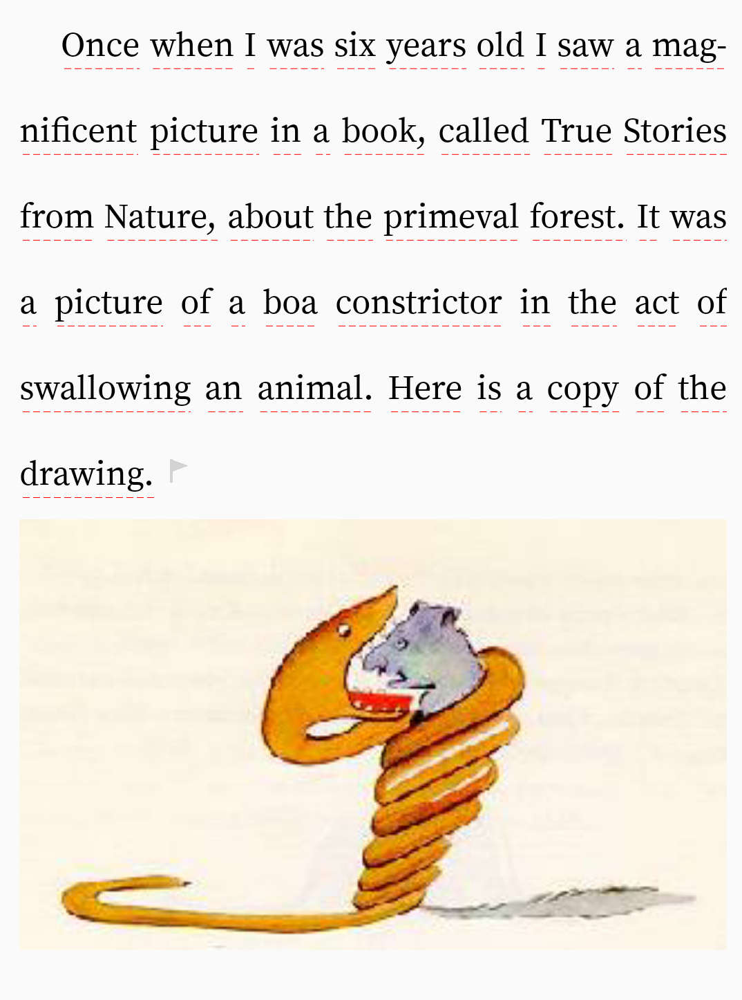

# Texas

**一个面向阅读场景的 Android 文本排版渲染引擎，用来替代 TextView 完成"书籍级"的图文排版。**

TextView 解决的是"把文字画出来"，Texas 解决的是"把文章排得像出版物一样好看，并且每个词都可以交互"。如果你在做阅读器、词典 / 语言学习、新闻资讯这类以长文本为核心的应用，Texas 提供了一整套 TextView 给不了的能力：TeX 级两端对齐、中文标点挤压、语义分词、词级 Tag 交互，以及针对长文档的增量排版与指令级缓存。



## 为什么不用 TextView？

| 能力 | TextView | Texas |
|------|----------|-------|
| 两端对齐 | API 26+ 才支持，且只做词间空格拉伸，容易出现"大空洞" | 与 TeX 相同的 Knuth-Plass 全局断行算法，整段最优，全版本可用 |
| 断字（hyphenation） | 依赖系统词典，不可定制 | 内置断字引擎，`triangle` 换行时显示为 `tri-angle`，可自定义 |
| 中文标点挤压 | ❌ 连续标点（如 `）。`）留白大，不符合出版规范 | ✅ 自动挤压，符合专业出版标准 |
| 中英文混排优化 | ❌ 英文字号、基线与中文不协调 | ✅ 自动调整英文字号与基线，视觉统一 |
| 分词粒度 | 按字符 / 简单规则断行 | 内置 NLP 语义分词，"机器学习"不会被拆成"机器 / 学习" |
| 词级交互 | 需要手工计算 offset 构造 `ClickableSpan`，难以维护 | 两级 Tag 系统，点击 / 高亮 / 选中直接拿到业务标识 |
| 内容更新 | `setText()` 全量重新测量、排版 | 增量更新，只重排变化的段落，其余走缓存 |
| 长文档渲染 | 需嵌套 ScrollView，一次性排版整篇文章 | 按 Segment 组织，配合三层缓存（布局 / 测量 / 绘制指令），滚动性能提升 300%+ |
| 图文混排 | `ImageSpan` 只适合内联小图 | `Figure`（防抖动图片）、`ViewSegment`（插入任意 View，可参与文本选中） |

一句话总结：**TextView 是通用文本控件，Texas 是专业排版引擎。** 内容越长、排版要求越高、交互越复杂，Texas 的优势越明显。

## 核心特性

- **📐 TeX 排版算法** — Knuth-Plass 全局断行 + 两端对齐 + 断字，排版质量对标印刷出版物（[算法详解](doc/algorithm/tex-algorithm.md)）
- **🇨🇳 中文排版优化** — 标点挤压、中英文混排基线 / 字号优化、NLP 语义分词（[设计文档](中文排版优化.pdf)）
- **🏷️ 两级 Tag 系统** — 段落级 + 词级标识，轻松实现点词翻译、句子高亮、笔记标注、搜索定位
- **⚡ 高性能长文档渲染** — 增量更新 + 指令级缓存，滚动、重绘、高亮都不触发重新排版
- **🧩 图文混排** — 段落、图片、任意自定义 View 混合排列，自定义 View 内的文本也能参与全文选中

## 快速开始

**1. 初始化**（Application 中）：

```java
Texas.init(this);
```

**2. 布局中添加 TexasView：**

```xml
<me.chan.texas.renderer.TexasView
    android:id="@+id/text"
    android:layout_width="match_parent"
    android:layout_height="match_parent" />
```

**3. 设置内容：**

```java
TexasView texasView = findViewById(R.id.text);

// 最简用法
texasView.setSource(new TextDocumentSource("hello world"));
```

带词级 Tag 的用法（点击任意词可拿到业务标识）：

```java
texasView.setSource(new TexasView.DocumentSource() {
    @Override
    protected Document onRead(TexasOption option, @Nullable Document previousDocument) {
        Paragraph.Builder builder = Paragraph.Builder.newBuilder(option)
                .tag("paragraph_001")
                // stream API 自动做语义分词，token 是完整的词
                .stream(text, 0, text.length(), (token) ->
                        Paragraph.SpanStyles.obtain(token).tag(new WordTag(token.toString())));
        return new Document.Builder().addSegment(builder.build()).build();
    }
});

texasView.setOnClickedListener(new OnClickedListenerAdapter() {
    @Override
    public void onSpanClicked(TexasView view, Paragraph paragraph, TouchEvent event, Span span) {
        WordTag tag = (WordTag) span.getTag();
        showTranslation(tag.word);  // 点到哪个词就是哪个词
    }
});
```

**4. 页面销毁时释放：**

```java
@Override
protected void onDestroy() {
    texasView.release();
    super.onDestroy();
}
```

更多用法（动态增量更新、高亮与选中、自定义数据源、ViewSegment、最佳实践）见 **[使用指南](doc/guide.md)**。

## 文档

| 文档 | 内容 |
|------|------|
| [使用指南](doc/guide.md) | Tag 系统、动态更新、高级排版特性、API 详解、最佳实践、FAQ |
| [API 约定](doc/api/api.md) | API 使用约定与稳定性说明 |
| [TeX 断行算法](doc/algorithm/tex-algorithm.md) | Knuth-Plass 算法原理详解 |
| [架构设计](doc/arch/arch.md) | 引擎整体架构 |
| [中文排版优化](中文排版优化.pdf) | 中文排版优化设计文档 |

## 模块

| 模块 | 说明 |
|------|------|
| `:library` | 核心引擎（AAR），minSdk 23 |
| `:ext-image` | 图片扩展（基于 Glide） |
| `:ext-markdown` | Markdown 渲染扩展 |
| `:ext-markdown-math` | Markdown 数学公式支持 |
| `:app` | Demo 应用 |

## 资源引用

- [english-words](https://github.com/dwyl/english-words.git)
- [async profiler](https://github.com/jvm-profiling-tools/async-profiler)
- [JHyphenator](https://github.com/mfietz/JHyphenator)
