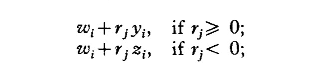
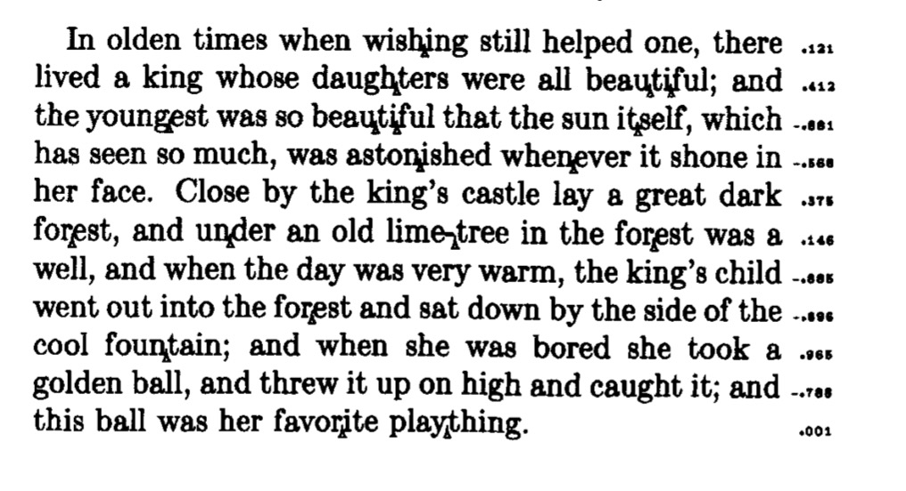
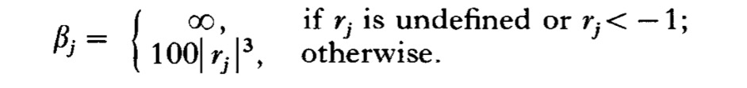
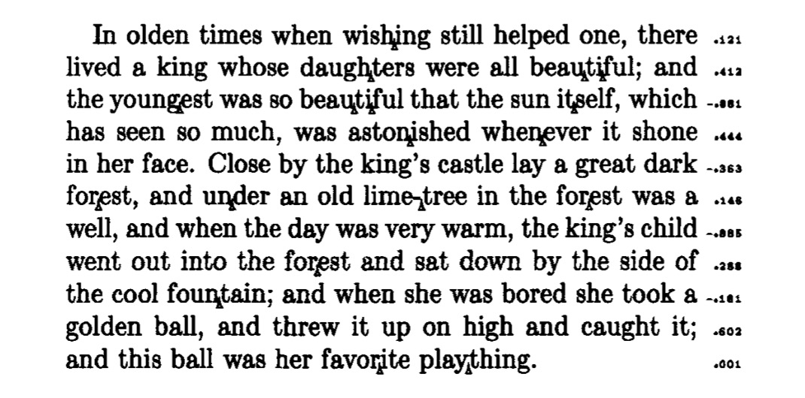
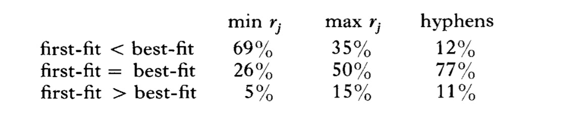
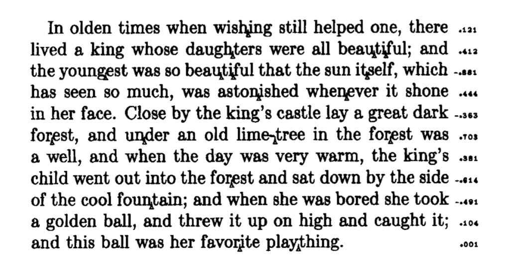
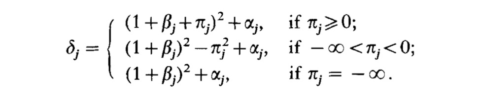
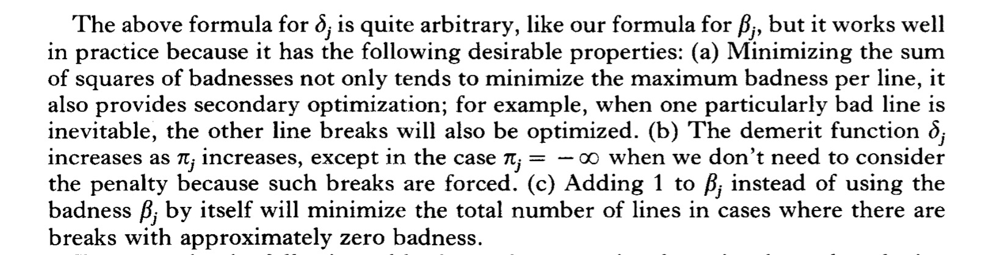
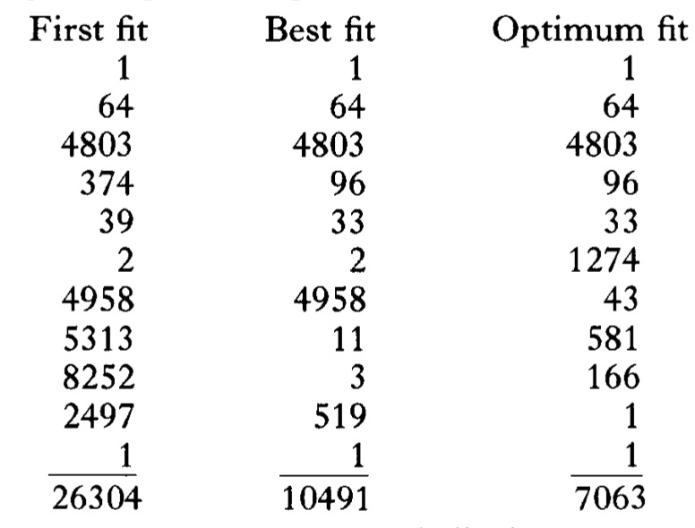

# Knuth-plass line breaking algorithm

## 约定

- KP 代指本文中提及的算法名缩写

## 数据结构

在KP算法中，一篇文章是由 x1 x2 x3 ... xm (m->+∞)这样的序列组成的。其中xi(1 <= i <= m）是如下数据结构之一：

- Box 需要被绘制的对象，这个对象可以是一个字符，一个表情，等等

- Glue 对应Box间的空格。在KP算法里，Glue有三个属性（Wi, Yi, Zi). Wi对应正常空格的宽度，Yi对应可伸缩的宽度，Zi对应可压缩的宽度。当正常空格不够排下一行的时候，空格宽度变成Zi，当正常空格显得太小的时候，空格宽度就变成Yi

- Penalty 代表可能的末尾行。 算法会计算一个值，这个值能描述在当前点断行对审美上的影响，以此来判断是否要在当前点换行。每一个Penalty有一个参数pi来帮助我们是否要在这里开始断行。pi是一个任意的值，所以它的取值是 (-∞, +∞), 其中∞代表的是一个很大的数字，在KP算法里，当pi大于等于1000的时候就被认为是+∞，当pi小于等于1000的时候就被认为是-∞。当pi=+∞的时候，换行被严格禁止，当pi=-∞，需要强制换行。一个Penalty也有它自己的宽度，当断行发生在一个penalty的时候，我们需要人为的追加一个宽度wi到当前行。比如，一个断行点发生在可以加连字符的地方，我就追加一个wi到末行，wi等于连字符宽度。另外Penalty还有一个标记fi, 取值 0 或 1。fi的作用下文会提及

## 抽象的概念（abstract form）

1. 如果一个段落需要首行缩进，那么我们在进行抽象表达的时候可以令第一个元素是一个空的box并且宽度是首行缩进的宽度

2. 一个单词可以变成box和penalty的序列，每个box含有的是单词中的每个字符，其中box宽度是受当前所用字体影响的，penalty的添加受音节的影响，它用来标注当前位置可以添加连字符。并且penalty是flagged的，即fi为1

3. 单词间由glue连接，glue的宽度通常跟字体绑定。在TEX排版系统中，不同的上下文，glue所代表的语义有所不同。

4. 显式的[连字符或者短破折号(dash)](https://www.grammarly.com/blog/dash/)后尾随一个flagged penalty。这个penalty的宽度为0。在有些排版风格中，针对长破折号（em dash），我们允许在长破折号之前断行，因此，我们在破折号之前加一个unflagged的penalty，并且它的宽度也是0。

5. 在段落的末尾，总是添加一个glue，来表示在最后一行的右边会有一个空格，并且有一个pm=-∞的penalty来强制换行。

## 简单的例子


## 衡量排版美观程度

- lj (1 <= j <= +∞)，表示的是第j行的期望宽度

- Lj (1 <= j <= +∞)，表示第J行真实宽度，它由第j行所有的box，glue宽累加得。注意，如果第j行末尾允许添加连字符，则计算的时候还需要加上连字符宽度。

- Yj (1 <= j <= +∞)，表示第J行拉伸和，它由累加第j行所有glue的y属性得出

- Zj 同理Yj，不过是累加z属性

由此我们可以引申出一个调整系数（adjustment ratio rj）

```
if Lj == lj 那么rj则为 0， 完美适配

if Lj < lj，那么真实大小小于宽度，这时候需要拉伸，此时rj = (lj - Lj) / Yj （rj仅在Yj大于0的情况下有意义，小于等于0则rj为未定义）

if Lj > lj，那么真实大小大于宽度，这时候需要压缩，此时rj = (lj - Lj) / Zj (rj仅在Zj大于0的情况下有意义，小于等于0则rj为未定义)
```

因此，在得出rj后我们，可以计算出j行所有glue的宽度




下图展示了不同rj时，对视觉上的影响



可以看到当rj小于0的时候，单词间会看起来的紧凑，大于0的时候会显得稀疏

**由此我们可以得出KP算法的主要目标**

> 尝试找出一种排版方式，使得所有的行都大似相同间隔，尽量规避单词间距过大或过小。-  Duncan et a1.’ in the early 1960

从KP算法角度来讲就是尽量使得 *|rj| <= 1*


## 衡量算法质量的指标

在1960年代的时候，Duncan就对排版算法做了一些具有突破性的研究。不过在他的研究中，所有的指标都是依赖 *wi - zi* 或者 *wi + yi* 的，而不仅仅是 *wi* 自身，在某些情况下，单一的影响因子往往不能适应极端情况，在某些苛刻条件下，算法表现会比较差。在KP算法里，衡量优劣由多个因子影响，而不是简单的认为 *rj* 超过一定阈值就认定排版效果不理想。

我们引入一个定量的指标*badness ratings*来表述第j行的排版情况，我们期望当*|rj|*足够小的时候，这个指标的值能够趋向于0，而当*|rj|*大于1的时候，这个值又能变化的很快，很容易我们可以想到以下这个公式：



我们尝试计算下上文中的段落badness ratings

```
0, 7, 68, 18, 5, 0, 69, 72, 90, 49, 0
```

我们可以看到，当 *rj < -1* 的时候，我们认为是糟糕透顶的，因为在这个情况下，我们不能让空格压缩到小于*wi - zi*，这样会让你认为你在渲染一个超长的单词。但是rj > 1的情况我们是可以接受的，因为我无论怎么稀疏，到底是不会影响阅读效果的。

到这里我们可以再做一点改进，之前的算法中，我们的排版可以说是短视的，这有点像是贪心算法。我们永远都是仅让当前行足够完美，但是有的时候，我们可以重新回溯之前选择的点，以求得整体上的最优，你可以类比动态规划算法。

类比下图，我们在原先*βj*的基础之上引入 *βj + πj*，*πj* 是penalty的p属性，如果某一页不以penalty结尾，那么 *πj* 为 0，否则为penalty的p属性值。




对比前文figure 1，4, 8, 和10行有所不同。

我们现在有两种算法，figure 1中的我们叫first-fit，figure 2中的我们称作best-fit

不过单一的段落不能够足以表述算法的优劣性，因此TP算法的研究人员参考了对大量的文本进行排版统计得出一下结论：



在69%的情况下，最小 *rj* 的比例first-fit要比best-fit小，最大rj情况下，有35%的比例，first-fit要比best-fit小。有次我们可以得出结论，first-fit比best-fit最紧凑的行还要再紧凑一点以及比best-fit最看宽松的行还要再宽松一点。

我们在看一张图：




这里我们让第六行显得宽松一点以防止第七行过于紧凑，并且让第十行更加的稀疏。

这正是我们下面要谈论的内容 **demerits**

## 缺陷评估值（demerits）



在这里 *βj*和*πj* 还是上述描述的几个参数，但是出现了*αj*，*αj*通常情况下为0直到当前行以一个flagged penalty结尾，*αj*是用来评估连续的进行添加连字符所带来的影响，通常这个值为3000。

那么，我们现在可以认为，我们算法的目标是最小化*βj*

虽然*βj*看起来很奇怪，但是它在实践中是表现最好的，因为影响它大小的不止一个因子



下面是针对三种优化算法demertis的统计图

