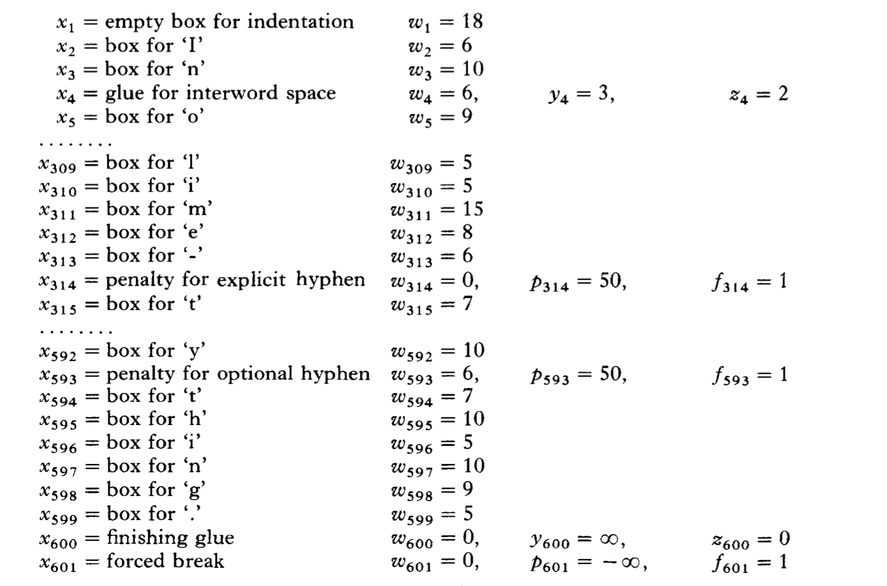
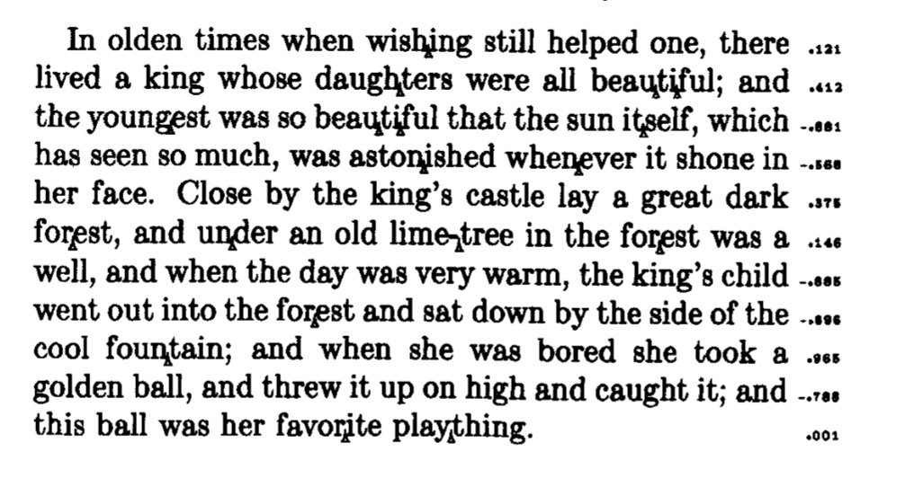
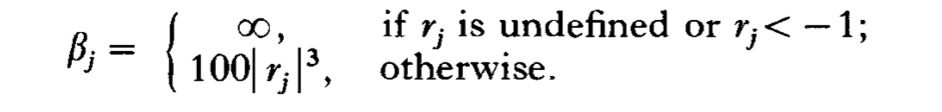
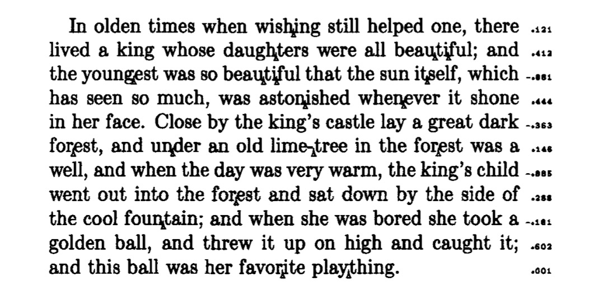
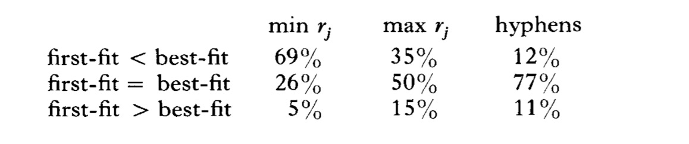
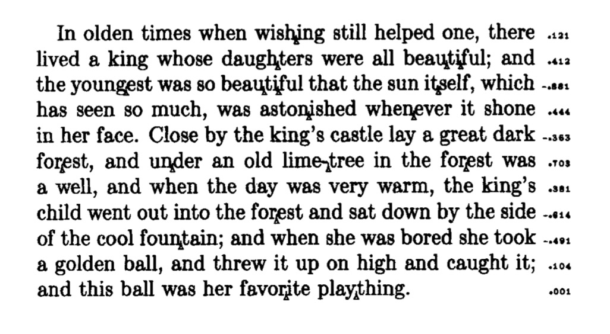
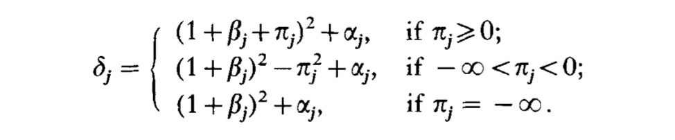
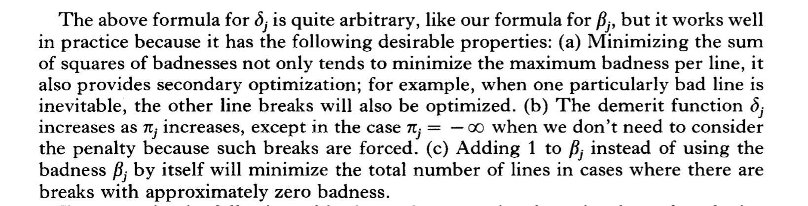
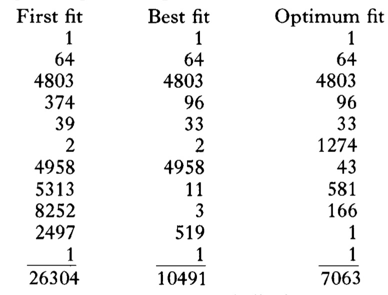

# Knuth-Plass 断行算法

本文介绍 Knuth 与 Plass 于 1981 年在论文 *Breaking Paragraphs into Lines* 中提出的断行算法（下文简称 KP 算法）。它是 TeX 排版系统的核心：与"排满一行就换行"的贪心策略不同，KP 算法把断行看作一个全局优化问题——先为"一行排得好不好"定义量化指标，再用动态规划在整个段落范围内寻找总代价最小的断点组合。

Texas 的 `TexParagraphTypesetter` 实现的就是这套算法，文末给出概念与代码的对照。

全文按推导顺序展开：

1. 先建立段落的抽象模型（Box / Glue / Penalty）；
2. 定义单行的量化指标：调整系数 r 与 badness β；
3. 说明贪心策略（first-fit / best-fit）的局限；
4. 引入行的综合代价 demerits δ，把目标改为最小化全段 δ 之和；
5. 给出动态规划求解过程。

## 段落的抽象模型

KP 算法不直接操作字符串，而是先把段落抽象成一个序列 x₁ x₂ … xₘ，其中每个元素是以下三种数据结构之一：

**Box（盒子）** —— 需要被绘制的对象，可以是一个字符、一个表情、一张行内图片等。Box 只有一个属性：宽度 w，宽度由内容和字体决定。Box 是刚性的，不参与伸缩。

**Glue（胶水）** —— 连接 Box 的弹性空白，通常对应单词间的空格。Glue 有三个属性 (w, y, z)：

| 属性 | 含义 |
|------|------|
| w | 理想宽度（正常空格的宽度） |
| y | 可拉伸量（stretch）：当一行排不满、需要撑开时，最多可以额外增加的宽度 |
| z | 可压缩量（shrink）：当一行排不下、需要挤压时，最多可以减少的宽度 |

"胶水"这个名字很形象：它把两侧的 Box 粘在一起，本身可以被拉长或压扁。

**Penalty（惩罚项）** —— 标记一个"潜在断点"，并描述在此断行对美观的影响。Penalty 有三个属性 (w, p, f)：

- **p：惩罚值**，取值范围 (-∞, +∞)。p 越大表示越不希望在此断行。KP 算法把 p ≥ +1000 视为 +∞（严格禁止断行），p ≤ -1000 视为 -∞（强制断行）。
- **w：宽度**。若断行真的发生在这个 Penalty 上，需要向当前行末尾追加的宽度。典型用途是连字符：在单词的音节边界放一个 w 等于连字符宽度的 Penalty，一旦在此断行，行尾就会多出一个连字符的宽度。不在此断行时 w 不生效。
- **f：标记位（flagged）**，取值 0 或 1。f = 1 表示在此断行会产生连字符（或类似的视觉元素）。它用于惩罚"连续多行都以连字符结尾"——这一点在 demerits 一节展开。

### 从文本到序列的转换规则

把一个段落翻译成 Box / Glue / Penalty 序列时，遵循以下约定：

1. **首行缩进**：在序列开头放一个空 Box，宽度等于缩进宽度。
2. **单词**：变成 Box 与 Penalty 交错的序列——每个字符一个 Box（宽度由字体决定）；在允许加连字符的音节边界插入 flagged Penalty（f = 1），其宽度为连字符的宽度。
3. **单词间空格**：用一个 Glue 连接，其 (w, y, z) 通常与字体绑定。在 TeX 中，不同上下文里 Glue 的语义会有所不同（句末空格通常比词间空格更"弹"）。
4. **显式的连字符与短破折号（dash）**：其后尾随一个宽度为 0 的 flagged Penalty——字符本身已经在文本里，断行不需要再追加宽度。有些排版风格允许在长破折号（em dash）**之前**断行，则在其前面再加一个宽度为 0 的 unflagged Penalty。
5. **段落结尾**：追加一个 y = ∞ 的 Glue（让最后一行右侧的空白吸收所有剩余空间，也就是最后一行天然左对齐），再加一个 p = -∞ 的 Penalty 强制换行。

下面是论文中的例子，一个约 600 个元素的段落序列的首尾片段（注意 x₁ 的缩进空 Box、x₃₁₄ 的显式连字符 Penalty、x₅₉₃ 的可选连字符 Penalty，以及结尾的 finishing glue 和强制断点）：



在这个模型下，"断行"就是从序列中选出若干个合法断点（Glue 或 p < +∞ 的 Penalty），把序列切成若干行。问题转化为：**选哪一组断点最好？** 要回答它，先得定义"好"。

## 单行的量化指标

### 调整系数 r

对第 j 行，定义：

- **lⱼ** —— 第 j 行的期望宽度（排版区域宽度）；
- **Lⱼ** —— 第 j 行的自然宽度：该行所有 Box 与 Glue 的 w 累加。若该行以连字符 Penalty 结尾，还要加上该 Penalty 的宽度；
- **Yⱼ** —— 该行所有 Glue 的 y 之和（总拉伸能力）；
- **Zⱼ** —— 该行所有 Glue 的 z 之和（总压缩能力）。

自然宽度和期望宽度往往不相等，差额要靠 Glue 伸缩来消化。定义**调整系数（adjustment ratio）rⱼ** 来描述伸缩的剧烈程度：

```
Lⱼ = lⱼ：完美适配，rⱼ = 0

Lⱼ < lⱼ：行排不满，需要拉伸，rⱼ = (lⱼ - Lⱼ) / Yⱼ    （仅当 Yⱼ > 0 时有定义）

Lⱼ > lⱼ：行排不下，需要压缩，rⱼ = (lⱼ - Lⱼ) / Zⱼ    （仅当 Zⱼ > 0 时有定义）
```

直观地说，rⱼ 以"自身弹性"为单位衡量变形量：r = 1 表示所有 Glue 恰好用尽了拉伸能力 y，r = -1 表示恰好用尽了压缩能力 z。确定 rⱼ 后，行内每个 Glue 的最终宽度按同一比例分摊：


下图是论文中的示例段落（每行右侧标注了该行的 rⱼ）。可以看到 rⱼ < 0 的行单词间距偏紧，rⱼ > 0 的行偏松：



于是 KP 算法的目标可以初步表述为：

> 尝试找出一种排版方式，使所有行的单词间距大致相同，尽量规避间距过大或过小。 —— Duncan et al., 1960s

即尽量让每一行都满足 **|rⱼ| ≤ 1**。

### Badness β

1960 年代 Duncan 就对排版算法做过开创性研究，但当时的指标只依赖单一因子（如 w - z 或 w + y），极端情况下表现较差。KP 算法改为用连续函数来刻画一行的"糟糕程度"，称为 **badness**：



这个公式满足两个期望的性质：|rⱼ| 足够小时 βⱼ 趋向 0；|rⱼ| 超过 1 后 βⱼ 以三次方速度快速增长。系数 100 使得 |r| = 1 时 β = 100，作为"可容忍"的边界值。

两种越界的处理是不对称的：**rⱼ < -1 直接视为 β = ∞**——压缩超过 z 意味着空格比最小宽度还窄，相邻单词会粘成一个"超长单词"，绝对不可接受；而 rⱼ > 1 只是被三次方重罚，并未禁止——间距再稀疏，终究不影响识读。

以上图 first-fit 排版的段落为例，各行的 badness 依次是：

```
0, 7, 68, 18, 5, 0, 69, 72, 90, 49, 0
```

## 贪心策略的局限：first-fit 与 best-fit

有了单行指标，最直接的算法是贪心：

- **first-fit**：逐行装填，一行装不下了就在最后一个合法断点断开。上文 figure 3 就是 first-fit 的结果。
- **best-fit**：仍然逐行确定，但每行在若干候选断点中选 βⱼ + πⱼ 最小的那个（πⱼ 是断点 Penalty 的 p 值；断点不是 Penalty 时 πⱼ = 0）。

best-fit 对同一段落的结果如下，与 first-fit 相比从第 4 行起断点开始分化：



单个段落说明不了普遍规律，论文作者对大量文本做了统计（每行含义：first-fit 的指标小于 / 等于 / 大于 best-fit 的段落占比）：



最显著的信号在第一列：69% 的段落里 first-fit 的最小 rⱼ 比 best-fit 更小——也就是说 first-fit 的最紧行往往被压得更紧。这符合直觉：贪心装填总是尽量往一行里塞内容。连字符用量上两者大体持平（77% 的段落相同）。

但 best-fit 仍然是"短视"的：它只让**当前行**尽量完美，从不回头修改已经确定的断点。而有些段落需要故意牺牲某一行，来换取后续行的从容——这就需要全局优化。看论文中的第三种结果（optimum-fit）：



对比 best-fit：这里故意把第 6 行排松一些（r = .703），避免了 best-fit 中第 7 行被压得过紧（r = -.885）。这种"以局部换全局"的取舍，贪心算法做不到——类比动态规划之于贪心。要做全局优化，先得定义**全局代价**。

## 行的综合代价：demerits

badness 只衡量间距的松紧，一行排得好不好还受其他因素影响（断点惩罚、连续连字符等）。KP 算法把这些因素合成为第 j 行的**缺陷值（demerits）δⱼ**：



其中：

- **βⱼ** —— 该行的 badness；
- **πⱼ** —— 该行末断点的 penalty 值（不以 Penalty 结尾时为 0）。π ≥ 0 时并入平方项一起惩罚；π < 0（鼓励断行）时以 -π² 的形式做奖励；π = -∞（强制断行）时不参与计算——反正必须在这断，没有惩罚的意义；
- **αⱼ** —— 连续连字符惩罚：仅当**当前行与上一行都**以 flagged Penalty（f = 1）结尾时生效，通常取 3000。这就是 f 标记位的用途——避免连续多行行尾挂着连字符的"梯子"效果。

这个公式看起来相当随意，但论文解释了它在实践中表现好的原因：



1. 全段最小化 δ 的**平方和**，不仅倾向于压低最差行的 badness，还提供二次优化——当某一行注定很糟时，其余行的断点仍会被优化；
2. δⱼ 随 πⱼ 单调递增（π = -∞ 的强制断行除外）；
3. 用 1 + βⱼ 而不是 βⱼ 本身，使得在各断法 badness 都接近 0 时，算法倾向于选**总行数最少**的方案（每多一行至少多付出 1² 的代价）。

至此可以给出 KP 算法的最终目标：**在所有合法的断点组合中，找到使全段 Σδⱼ 最小的那一组。** 这就是 optimum-fit（也称 total-fit）。下图是示例段落在三种算法下每行的 demerits 及总和：



总代价 first-fit 26304、best-fit 10491、optimum-fit 7063。注意 optimum-fit 的单行代价并非行行最优（第 6 行付出了 1274），但总和最小——正是全局优化的体现。

## 动态规划求解

朴素地枚举所有断点组合是指数级的，KP 算法用动态规划把它降到近似线性。核心观察是：**第 j 行的 δⱼ 只依赖本行的内容和行首位置（以及上一行是否以连字符结尾、fitness 等级），与更早的断点选法无关**——这正是最优子结构。

算法维护一个**活跃节点（active node）链表**。每个节点代表一个"可能成为某行行首"的断点，记录：到达该断点的最小累计 demerits、行号、该断点处的累计宽度 (ΣW, ΣY, ΣZ)，以及指向前驱断点的链接（用于最终回溯出断点序列）。

对序列做一次线性扫描，每遇到一个合法断点 b：

1. **对每个活跃节点 a**：用累计宽度之差算出"从 a 断到 b 构成一行"的调整系数 r（前缀和相减，O(1)）；
2. **淘汰**：若 r < -1（压缩超限，b 以及更远的断点只会更挤），或 b 是强制断点（任何行都不可能跨过它），把 a 移出活跃链表；
3. **接纳**：若 r 在容忍范围内，计算这一行的 demerits 并累加 a 的历史代价，得到"经由 a 到达 b"的总代价；
4. **择优建点**：所有活跃节点比较完后，为 b 创建新的活跃节点，代价取最小者，前驱指向对应的 a。

扫描结束后，从段落末尾的强制断点对应的节点沿前驱链接回溯，即得最优断点序列。

### Fitness 等级

第 3 步的择优有一个细节：不能只按总代价保留一个最优者。demerits 公式惩罚的是单行内部的问题，但**相邻两行一紧一松**同样刺眼。KP 算法按 r 把行分成四个 fitness 等级：

| 等级 | 条件 | 直观描述 |
|------|------|---------|
| 0 (tight) | r < -0.5 | 紧 |
| 1 (decent) | -0.5 ≤ r ≤ 0.5 | 舒适 |
| 2 (loose) | 0.5 < r ≤ 1 | 松 |
| 3 (very loose) | r > 1 | 很松 |

相邻两行的等级相差超过 1 时，额外追加一笔 demerits。由于"到达断点 b 时处于哪个等级"会影响后续代价，同一个断点要**按等级分别保留最优节点**（最多 4 个），才能保证全局最优。

活跃节点的数量通常是一个小常数（容忍范围会不断淘汰过远的节点），所以整体复杂度在实践中接近 O(n)。

## Texas 中的实现对照

`TexParagraphTypesetter` 按上述动态规划实现，概念与代码的对应关系：

| 论文概念 | Texas 实现 |
|---------|-----------|
| Box / Glue / Penalty | `me.chan.texas.text.layout` 包的 `Box`、`Glue`、`Penalty`，公共基类 `Element` |
| 断点节点（demerits、行号、fitness、前驱链接） | `typesetter/tex/Node`（含 `link` 前驱指针，经 `ObjectPool` 复用） |
| 活跃节点链表 | `typesetter/tex/ActiveNodes` |
| 累计宽度前缀和 (ΣW, ΣY, ΣZ) | `typesetter/tex/Sum` |
| 按 fitness 等级择优 | `typesetter/tex/Candidates` / `Candidate` |
| 调整系数 r | `TexParagraphTypesetter#computeAdjustRatio` |
| fitness 分级（±0.5、1 为界） | `TexParagraphTypesetter#computeFitness` |
| badness + demerits（含 flagged、fitness 跳级惩罚） | `TexParagraphTypesetter#computeDemerits` |
| r 的容忍范围 | `Context.args` 的 `minTolerance` / `maxTolerance` |
| p = ±∞ | `Texas.INFINITY_PENALTY` |

## 参考

- Donald E. Knuth, Michael F. Plass. *Breaking Paragraphs into Lines*. Software: Practice and Experience, 1981.（本文全部插图出自该论文）
- [Dash 的用法](https://www.grammarly.com/blog/dash/)
