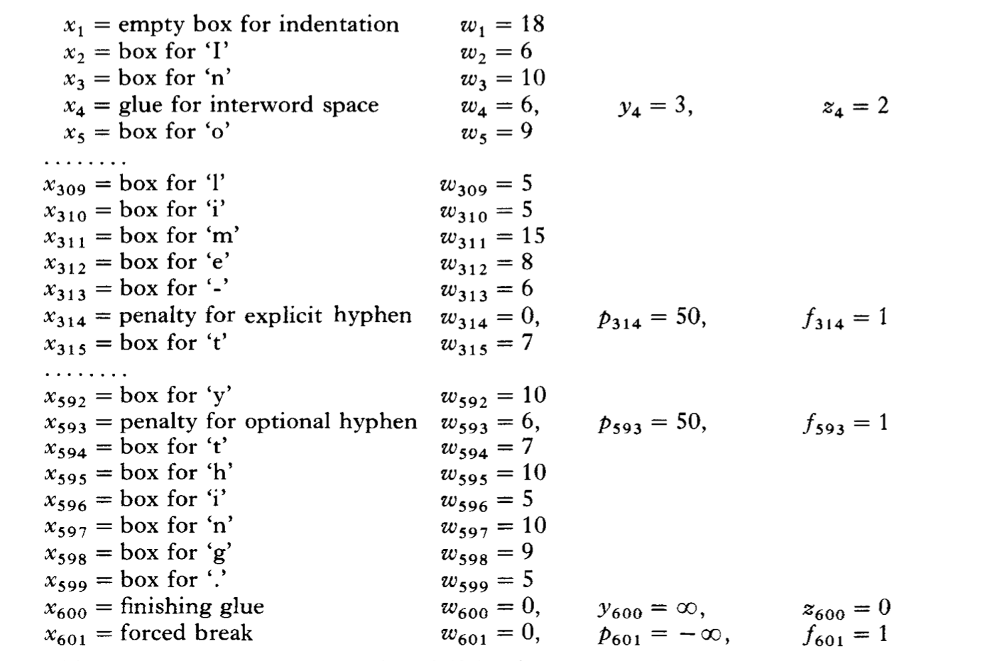

# Knuth-plass line breaking algorithm

## 约定

- KP 代指本文中提及的算法名缩写

## 数据结构

在KP算法中，一篇文章是由 x1 x2 x3 ... xm (m->+∞)这样的序列组成的。其中xi(1 <= i <= m）是如下数据结构之一：

- Box 需要被绘制的对象，这个对象可以是一个字符，一个表情，等等

- Glue 对应Box间的空格。在KP算法里，Glue有三个属性（Wi, Yi, Zi). Wi对应正常空格的宽度，Yi对应可伸缩的宽度，Zi对应可压缩的宽度。当正常空格不够排下一行的时候，空格宽度变成Zi，当正常空格显得太小的时候，空格宽度就变成Yi

- Penalty 代表可能的末尾行。 算法会计算一个值，这个值能描述在当前点断行对审美上的影响，以此来判断是否要在当前点换行。每一个Penalty有一个参数pi来帮助我们是否要在这里开始断行。pi是一个任意的值，所以它的取值是 (-∞, +∞), 其中∞代表的是一个很大的数字，在KP算法里，当pi大于等于1000的时候就被认为是+∞，当pi小于等于1000的时候就被认为是-∞。当pi=+∞的时候，换行被严格禁止，当pi=-∞，需要强制换行。一个Penalty也有它自己的宽度，当断行发生在一个penalty的时候，我们需要人为的追加一个宽度wi到当前行。比如，一个断行点发生在可以加连字符的地方，我就追加一个wi到末行，wi等于连字符宽度。另外Penalty还有一个标记fi, 取值 0 或 1。fi的作用下文会提及

## 抽象的概念（abstract form）

1. 如果一个段落需要首行缩进，那么我们在进行抽象表达的时候可以令第一个元素是一个空的box并且宽度是首行缩进的宽度

2. 一个单词可以变成box和penalty的序列，每个box含有的是单词中的每个字符，其中box宽度是受当前所用字体影响的，penalty的添加受音节的影响，它用来标注当前位置可以添加连字符。并且penalty是flagged的，即fi为1

3. 单词间由glue连接，glue的宽度通常跟字体绑定。在TEX排版系统中，不同的上下文，glue所代表的语义有所不同。

4. 显式的[连字符或者短破折号(dash)](https://www.grammarly.com/blog/dash/)后尾随一个flagged penalty。这个penalty的宽度为0。在有些排版分割中，针对长破折号（em dash），我们允许在长破折号之前断行，因此，我们在破折号之前加一个unflagged的penalty，并且它的宽度也是0。

5. 在段落的末尾，总是添加一个glue，来表示在最后一行的右边会有一个空格，并且有一个pm=-∞的penalty来强制换行。

## 简单的例子

