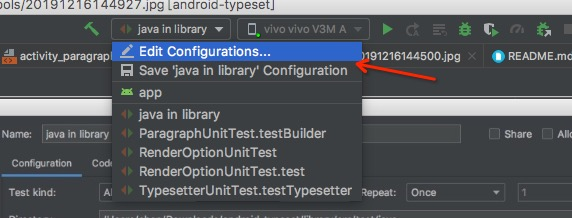
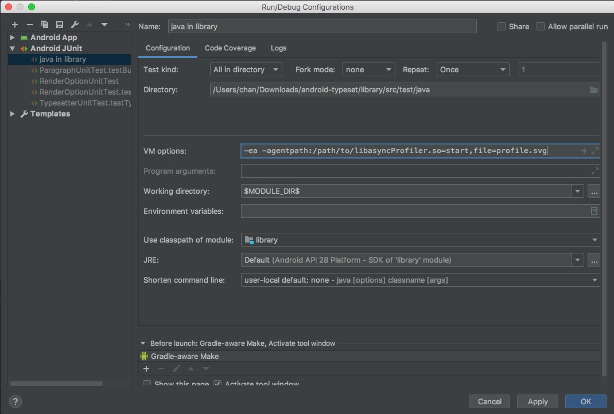
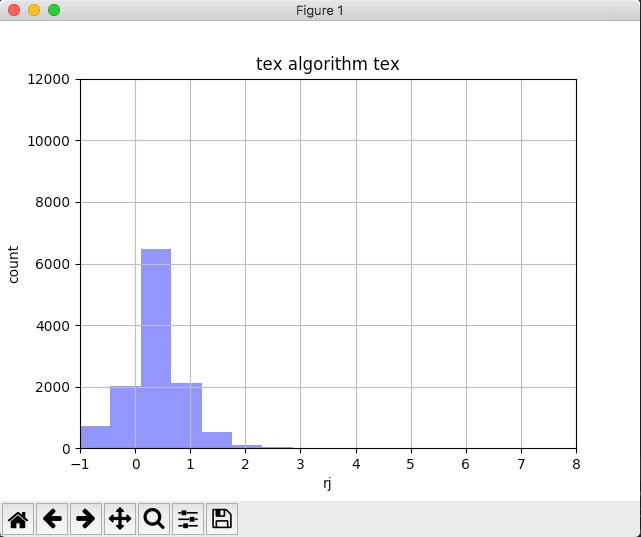

# 配套工具

## 性能优化工具

如果不希望在android设备上进行性能优化，找到当前repo下的async-profiler-1.6-macos-x64

```shell
cd 3rd/async-profiler-1.6-macos-x64
cat README.md
```
1. 配置junit运行参数



2. 我们推荐使用agent的方式加载async-profiler，这个README.md里有agent的使用方法，主要就是设置jvm的参数



## 算法质量可视化工具

1. 进入 evaluation 目录

2. 如果是第一次安装，运行

```shell
./install.sh
```

3. 运行start.sh

```shell
./start.sh
```

4. 打开texas的调试功能

5. 当每次排版之后都会收集到排版效果的图表


